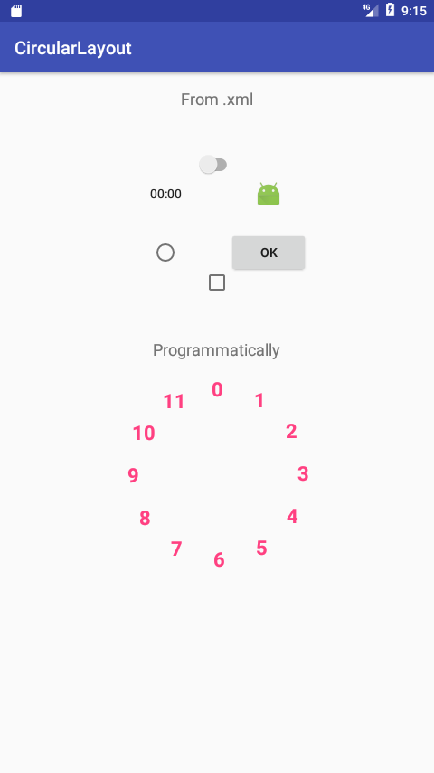

# CircularLayout

A layout that arranges other views in a circle.

## Demo


## Download
Add this line to the `build.gradle` of your module:
```groovy
compile 'com.github.andreilisun:circular-layout:1.0'
``` 

## How to use

### From .xml

```xml
<com.github.andreilisun.circular_layout.CircularLayout
        android:layout_width="220dp"
        android:layout_height="220dp">
        
        <android.support.v7.widget.SwitchCompat
            android:layout_width="wrap_content"
            android:layout_height="wrap_content" />
            
        <ImageView
            android:layout_width="30dp"
            android:layout_height="30dp"
            android:src="@mipmap/ic_launcher" />
            
        <Button
            android:layout_width="wrap_content"
            android:layout_height="wrap_content"
            android:text="@string/ok" />
            
        <CheckBox
            android:layout_width="wrap_content"
            android:layout_height="wrap_content" />
            
        <RadioButton
            android:layout_width="wrap_content"
            android:layout_height="wrap_content" />
            
        <Chronometer
            android:layout_width="wrap_content"
            android:layout_height="wrap_content" />
            
</com.github.andreilisun.circular_layout.CircularLayout>
```

### Programmatically
Have a look at the [sample](https://github.com/andreilisun/Circular-Layout/tree/master/sample/src/main).

## License
```
Copyright 2017 Lisun Andrii.
Licensed under the Apache License, Version 2.0 (the "License");
you may not use this file except in compliance with the License.
You may obtain a copy of the License at

   http://www.apache.org/licenses/LICENSE-2.0

Unless required by applicable law or agreed to in writing, software
distributed under the License is distributed on an "AS IS" BASIS,
WITHOUT WARRANTIES OR CONDITIONS OF ANY KIND, either express or implied.
See the License for the specific language governing permissions and
limitations under the License.
```